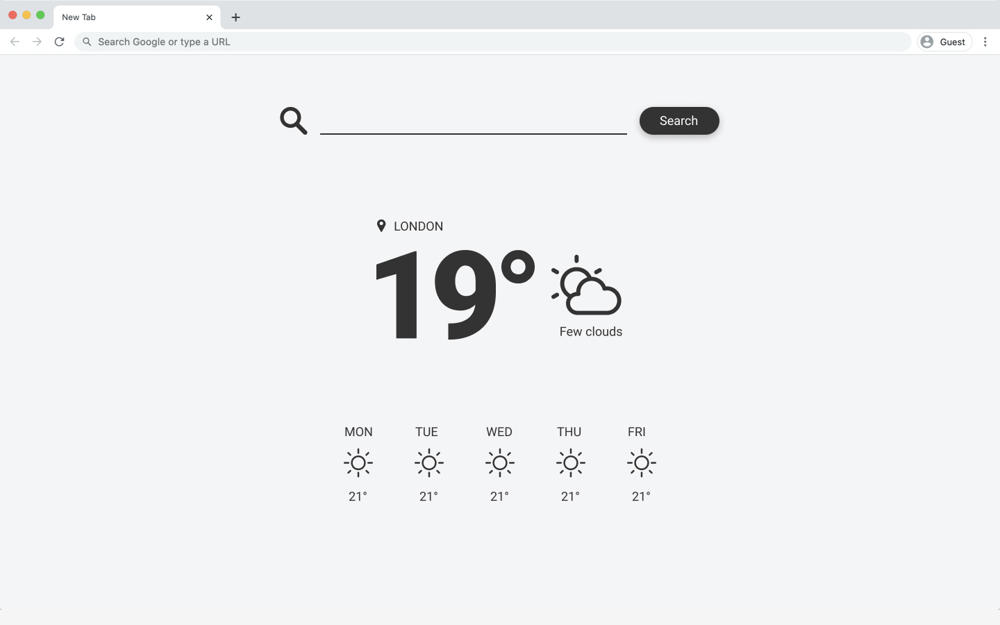

# Weather Forecast
A _Weather App_ that shows the current weather and the 5-day forecast of the location users type in the search field.

## Content

- [X] Wrap the project into a Docker container
- [X] Use of Redux to keep the state of the application
- [X] The website is responsive and look nice on all screens
- [X] The website works in all modern browsers
- [X] Unit tests with JEST and E2E tests with Cypress
- [X] Optional: requests are cached in browser (localstorage)
- [X] Linters, prettifiers, etc. are not mandatory, but highly recommended.

## Libraries and Frameworks

#### External 
- [X] [Create React App](https://github.com/facebook/create-react-app)
- [X] [Redux Toolkit](https://redux-toolkit.js.org/)
- [X] [Redux Devtools Extension](https://github.com/zalmoxisus/redux-devtools-extension)
- [X] [TypeScript](https://www.typescriptlang.org/)
- [X] [Material-UI](https://material-ui.com/)
- [X] [Cypress](https://www.cypress.io)
- [X] [Jest Fetch Mock](https://github.com/jefflau/jest-fetch-mock/)

## Information
Check [React-Seed](https://github.com/imransilvake/React-Seed) to understand how to build and serve this project as well as how to use SCSS and JS linting.
